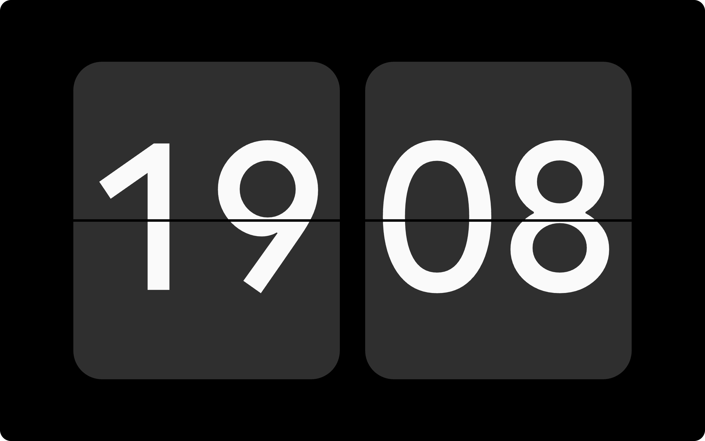
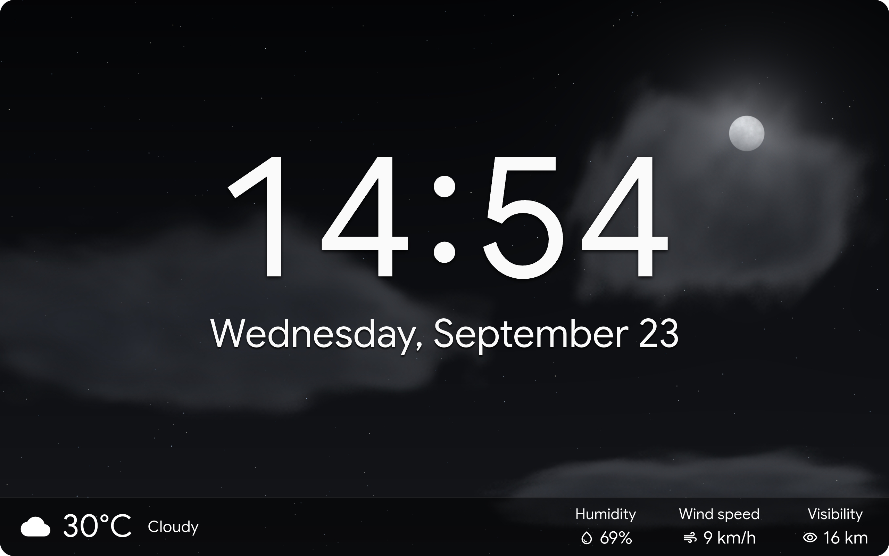

<h1 align="center">
  <picture>
    <source media="(prefers-color-scheme: dark)" srcset="assets/banners/ks_banner_dark.svg" />
    <source media="(prefers-color-scheme: light)" srcset="assets/banners/ks_banner_light.svg" />
    
  </picture>
</h1>

  Kiosk Satellite is an Android app designed for dedicated Home Assistant kiosks, with native Voice Satellite support, synchronized music playback and photo screensavers. 
  Kiosk Satellite is fully local and free for personal, non-commercial use.

  <a href="https://kiosksatellite.com/download/">Download</a> · <a href="https://kiosksatellite.com/#get-started">Get started</a> · <a href="https://kiosksatellite.com/docs/">Documentation</a>

  

## Features

&bull; **Native voice control:** Combine it with [Voice Satellite](https://github.com/jxlarrea/voice-satellite-card-integration) for native wake-word detection that works with the screen off or, with background listening enabled, while another app is open. Microphone access also works with HTTP dashboards without setting up certificates.

  

&bull; **Dashboard performance:** Optional [optimizations](https://kiosksatellite.com/docs/optimizations/) reduce unnecessary dashboard updates and pause rendering during screensavers to lower CPU and GPU usage on older devices. Voice and the Home Assistant connection stay active.

&bull; **[Music playback](https://kiosksatellite.com/docs/sendspin/):** Synchronized Music Assistant audio through Sendspin, with the option to follow a Home Assistant or Sonos player. The full-screen Now Playing view shows album art, playback controls and supported lyrics.

  
  
  

&bull; **Screensavers:** [Immich albums](https://kiosksatellite.com/docs/immich/), local photos, clocks and weather mood, with motion, face or presence detection to wake the kiosk.

&bull; **Home Assistant integration:** The built-in [ESPHome connection](https://kiosksatellite.com/docs/esphome/) exposes screen controls, volume and device sensors. An optional Bluetooth proxy relays nearby Bluetooth devices to Home Assistant.

&bull; **Remote administration:** Configure the app, view live screenshots, read logs and back up settings from a browser. [Fleet management](https://kiosksatellite.com/docs/fleet/) shares configuration profiles and coordinates updates across multiple kiosks.

  

&bull; **Intercom:** Kiosks can call each other or broadcast to all kiosks at once using the [Intercom](https://kiosksatellite.com/docs/intercom/) feature. Kiosks are auto discovered in the local network. 

&bull; **Kiosk conveniences:** Use [hand gestures](https://kiosksatellite.com/docs/gestures/#show-fingers) to run Home Assistant actions or open a camera view by holding up fingers to the device camera. Set Kiosk Satellite as the [home launcher](https://kiosksatellite.com/docs/home-launcher/) on supported devices so the Home button returns to your dashboard. Arrange up to twelve live feeds in [camera views](https://kiosksatellite.com/docs/cameras/), with camera imports from Home Assistant or Go2RTC.

Also built in: [PIN-protected kiosk mode](https://kiosksatellite.com/docs/kiosk/), [touch and clap gestures](https://kiosksatellite.com/docs/gestures/), [DLNA media playback](https://kiosksatellite.com/docs/dlna/), [RTSP streaming](https://kiosksatellite.com/docs/camera/#rtsp-streaming), [Shizuku support](https://kiosksatellite.com/docs/shizuku/) and more!

  
  

## Get started

You need **Android 7.0 or newer**, a reachable Home Assistant instance and a long-lived access token from **Home Assistant Profile → Security → Long-lived access tokens**.

1. [Download the latest APK](https://kiosksatellite.com/download) on your Android device.
2. Open it to install. Allow installation from this source if Android asks.
3. Launch Kiosk Satellite and follow the setup wizard to connect Home Assistant and choose your dashboard.

You can also enable Remote Administration in the first setup step and finish setup from your computer at `http://<device-ip>:2324`.

For voice control, install [Voice Satellite](https://github.com/jxlarrea/voice-satellite-card-integration) through HACS. Kiosk Satellite detects it and uses its configuration automatically.

## Documentation

[Voice Satellite](https://github.com/jxlarrea/voice-satellite-card-integration) · [Screensavers](https://kiosksatellite.com/docs/screensavers/) · [Music](https://kiosksatellite.com/docs/sendspin/) · [ESPHome & Bluetooth](https://kiosksatellite.com/docs/esphome/) · [Fleet management](https://kiosksatellite.com/docs/fleet/)

<strong>All guides and API references</strong>

  
&bull; **Display:** [Screen settings](https://kiosksatellite.com/docs/screen/), [screensavers](https://kiosksatellite.com/docs/screensavers/), [Immich](https://kiosksatellite.com/docs/immich/) and [At a Glance widgets](https://kiosksatellite.com/docs/at-a-glance/).

&bull; **Voice and media:** [Voice Satellite](https://github.com/jxlarrea/voice-satellite-card-integration), [microphone](https://kiosksatellite.com/docs/microphone/), [media player](https://kiosksatellite.com/docs/sendspin/), [camera views](https://kiosksatellite.com/docs/cameras/), [device camera](https://kiosksatellite.com/docs/camera/), [intercom](https://kiosksatellite.com/docs/intercom/) and [DLNA](https://kiosksatellite.com/docs/dlna/).

&bull; **Kiosk setup:** [Lockdown](https://kiosksatellite.com/docs/kiosk/), [home launcher](https://kiosksatellite.com/docs/home-launcher/), [gestures](https://kiosksatellite.com/docs/gestures/), [optimizations](https://kiosksatellite.com/docs/optimizations/), [permissions](https://kiosksatellite.com/docs/permissions/), [Shizuku](https://kiosksatellite.com/docs/shizuku/) and [updates](https://kiosksatellite.com/docs/updates/).

&bull; **Automation and management:** [ESPHome](https://kiosksatellite.com/docs/esphome/), [fleet management](https://kiosksatellite.com/docs/fleet/), [Remote API](https://kiosksatellite.com/docs/remote-api/), [TLS encryption](https://kiosksatellite.com/docs/tls/) and [JavaScript API](https://kiosksatellite.com/docs/js-api/).

&bull; **Device guides:** [Amazon Fire tablets](https://kiosksatellite.com/docs/fire/) and [Meta Portal](https://kiosksatellite.com/docs/portal/).

&bull; **Plugin Manager:** Install and create [community plugins](https://kiosksatellite.com/docs/plugins/) for Kiosk Satellite.

 
## Thank you for your support

Thank you to everyone who supports my work through [Buy Me a Coffee](https://buymeacoffee.com/jxlarrea). I test everything on real hardware, which means buying devices to reproduce issues and check changes across different manufacturers and Android flavors. Your contributions help cover those purchases and make that testing possible.

## License and credits

Free for personal, non-commercial use under [CC BY-NC-ND 4.0](LICENSE). Commercial use of the application and redistribution of modified application builds are not permitted. Independent plugins have [additional permission](PLUGIN-EXCEPTION.md).

Built with these projects

  
Thanks to [Home Assistant](https://www.home-assistant.io/), [ESPHome](https://esphome.io/), [Music Assistant](https://www.music-assistant.io/), [Immich](https://immich.app/), [Flutter](https://flutter.dev/), [flutter_inappwebview](https://inappwebview.dev/) and [ONNX Runtime](https://onnxruntime.ai/).

Wake-word support builds on [vsWakeWord](https://github.com/jxlarrea/voice-satellite-card-integration), [openWakeWord](https://github.com/dscripka/openWakeWord) and [microWakeWord](https://github.com/kahrendt/microWakeWord). Icons come from [Material Design Icons](https://pictogrammers.com/library/mdi/). Fonts include [Rubik](https://fonts.google.com/specimen/Rubik), [Nunito](https://fonts.google.com/specimen/Nunito), [Inter](https://rsms.me/inter/) and [DSEG](https://github.com/keshikan/DSEG).

Thank you to the package authors whose work makes Kiosk Satellite possible.

